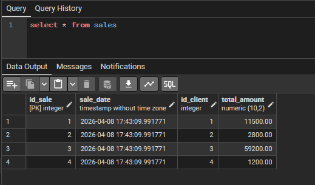
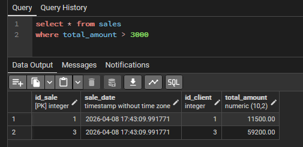
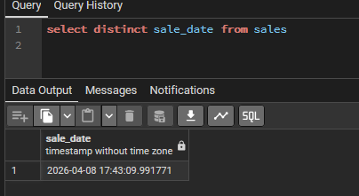
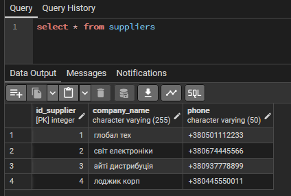
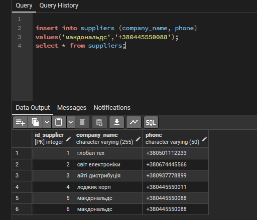
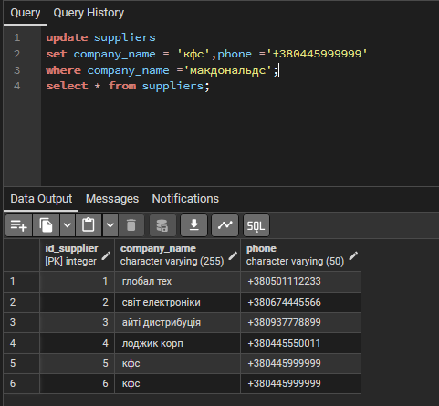
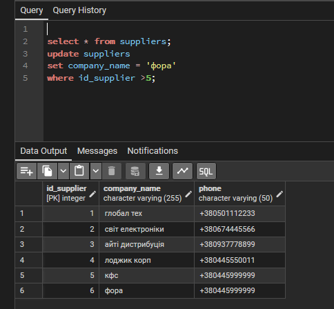
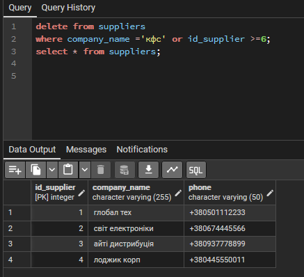

## я переробив ER таблицю та sql код, щоб вони були більш складні, вони находяться в файлі [remadelab1_2](remadelab1_2)

1 показати всі данні про продажі

```sql
select * from sales;
```


2 показати всі данні про продажі де загальна кількість більше 3000
```sql
select * from sales
where total_amount > 3000
```


3 показати неповторний час транзакцій в данних про продаж

```sql
select distinct sale_date from sales

```


4 показати всі данні про постачальників
```sql
select distinct * from sales
```


5 додати 2 нових постальчальників 
```sql

insert into suppliers (company_name, phone) 
values('макдональдс','+380445550088');
select * from suppliers;
```


6 оновити постачальника 'макдональдс' на 'кфс'
```sql
update suppliers 
set company_name = 'кфс',phone ='+380445999999'
where company_name ='макдональдс';
select * from suppliers;
```


7 замінити постачальників номера яких більше 5
```sql
select * from suppliers;
update suppliers 
set company_name = 'фора'
where id_suppliers >5;
```


8 видалити постачальників 'кфс' або номер яких більше або рівно 6

```sql
delete from suppliers 
where company_name ='кфс' or id_supplier >6;
select * from suppliers;
```



