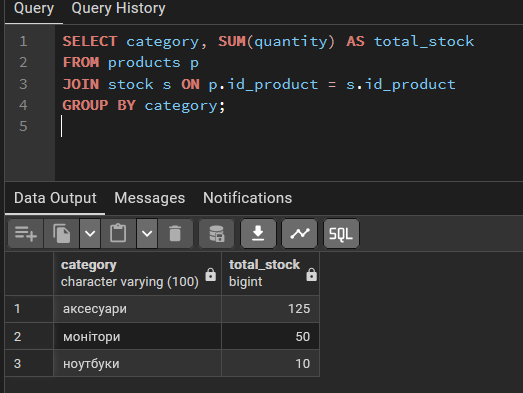
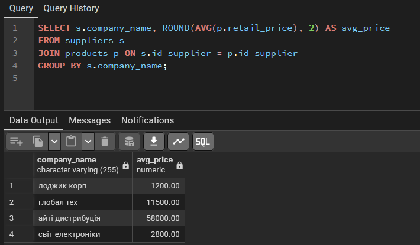
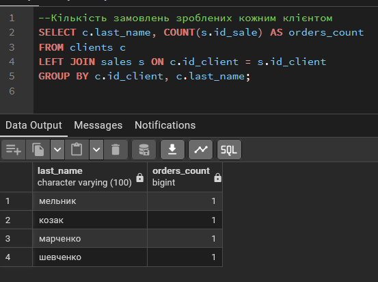
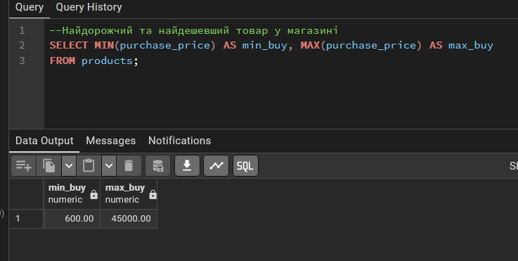
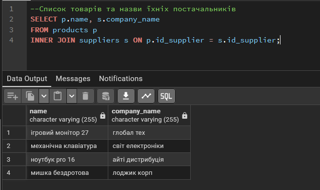
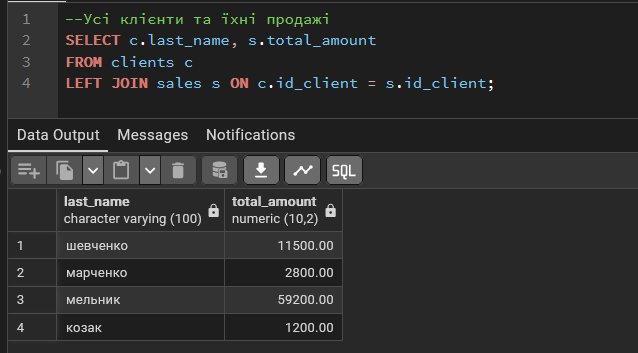
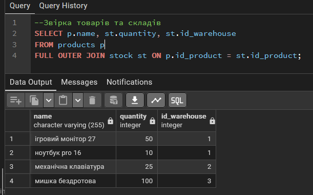
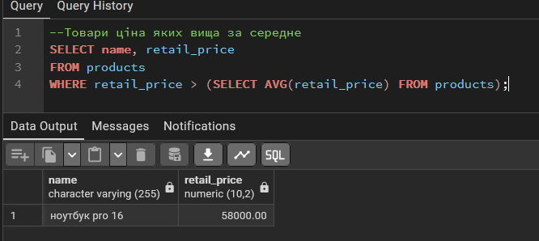
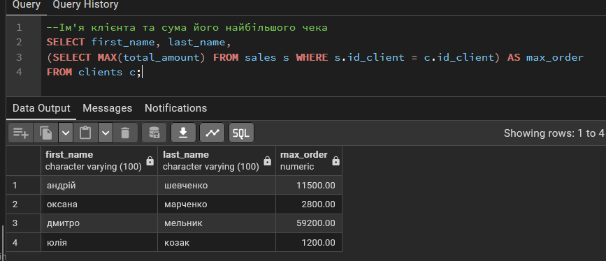
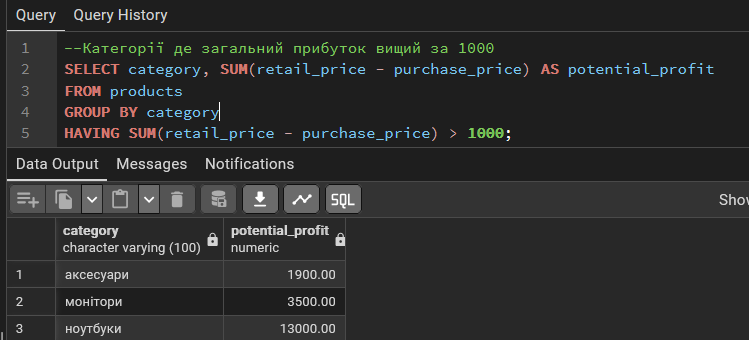

# Агрегаційні функції та GROUP BY

# №1 SUM та GROUP BY
```sql
--Загальна кількість товарів у кожній категорії
SELECT category, SUM(quantity) AS total_stock
FROM products p
JOIN stock s ON p.id_product = s.id_product
GROUP BY category;
```



# №2 AVG 

```sql
--Середня ціна товарів для кожного постачальника
SELECT s.company_name, ROUND(AVG(p.retail_price), 2) AS avg_price
FROM suppliers s
JOIN products p ON s.id_supplier = p.id_supplier
GROUP BY s.company_name;

```


# №3 COUNT 

```sql
--Кількість замовлень зроблених кожним клієнтом
SELECT c.last_name, COUNT(s.id_sale) AS orders_count
FROM clients c
LEFT JOIN sales s ON c.id_client = s.id_client
GROUP BY c.id_client, c.last_name;
```


# №4 MIN та MAX
```sql
--Найдорожчий та найдешевший товар у магазині
SELECT MIN(purchase_price) AS min_buy, MAX(purchase_price) AS max_buy
FROM products;
```


# джойни 

# №1 INNER JOIN
```sql
--Список товарів та назви їхніх постачальників
SELECT p.name, s.company_name
FROM products p
INNER JOIN suppliers s ON p.id_supplier = s.id_supplier;

```


# №2 LEFT JOIN
```sql
--Усі клієнти та їхні продажі
SELECT c.last_name, s.total_amount
FROM clients c
LEFT JOIN sales s ON c.id_client = s.id_client;
```



# №3 FULL JOIN
```sql
--Звірка товарів та складів
SELECT p.name, st.quantity, st.id_warehouse
FROM products p
FULL OUTER JOIN stock st ON p.id_product = st.id_product;
```


# Підзапити

# №1 WHERE
```sql
--Товари ціна яких вища за середне
SELECT name, retail_price
FROM products
WHERE retail_price > (SELECT AVG(retail_price) FROM products);
```


# №2 SELECT
```sql 
--Ім'я клієнта та сума його найбільшого чека
SELECT first_name, last_name,
(SELECT MAX(total_amount) FROM sales s WHERE s.id_client = c.id_client) AS max_order
FROM clients c;
```


# №3 HAVING
```sql
--Категорії де загальний прибуток вищий за 1000
SELECT category, SUM(retail_price - purchase_price) AS potential_profit
FROM products
GROUP BY category
HAVING SUM(retail_price - purchase_price) > 1000;
```



