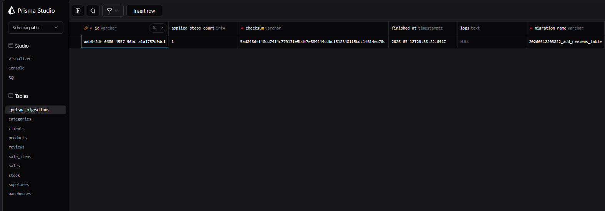
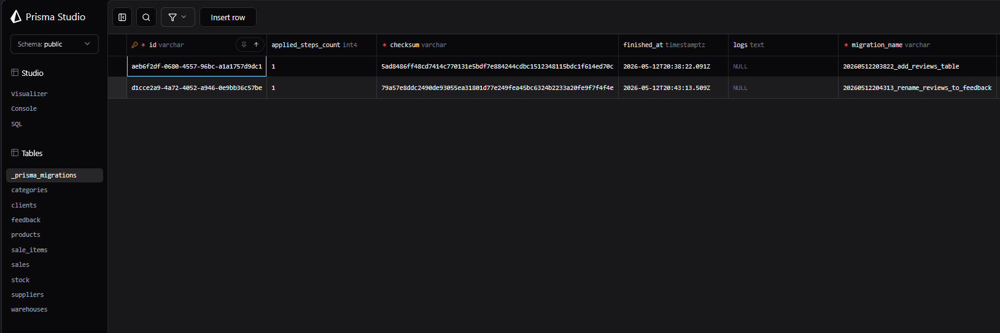
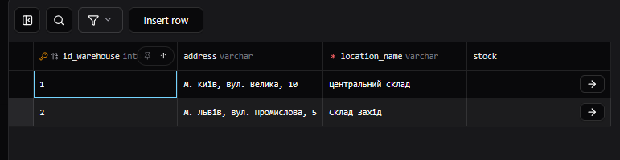
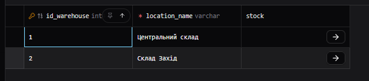
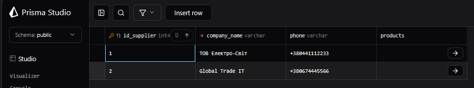
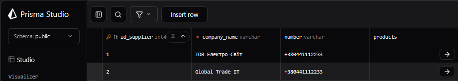

### `reviews` (Нова таблиця) 
Дає можливість клієнтам залишати відгки

```sql
model reviews {
  id         Int      @id @default(autoincrement())
  rating     Int
  comment    String?
  created_at DateTime @default(now())
}
```



## Зміна назви таблиці reviews в feedback
```sql
-- DropTable
DROP TABLE "reviews";

-- CreateTable
CREATE TABLE "feedback" (
    "id" SERIAL NOT NULL,
    "rating" INTEGER NOT NULL,
    "comment" TEXT,
    "created_at" TIMESTAMP(3) NOT NULL DEFAULT CURRENT_TIMESTAMP,

    CONSTRAINT "feedback_pkey" PRIMARY KEY ("id")
);
```


## Видалення колонки address з таблиці warehouses

```sql
-- Було:
model warehouses {
  id      Int    @id @default(autoincrement())
  name    String
  address String // Цей рядок видаляємо
}

-- Стало:
model warehouses {
  id   Int    @id @default(autoincrement())
  name String
}
```
До


Після


## Зміна назви колонки phone з таблиці suppliers в number
```sql
-- Було:
model suppliers {
  id      Int       @id @default(autoincrement())
  name    String
  phone   String?   // Змінюємо це
  products products[]
}

-- Стало:
model suppliers {
  id      Int       @id @default(autoincrement())
  name    String
  number  String?   // Нова назва
  products products[]
}
```
До


Після

